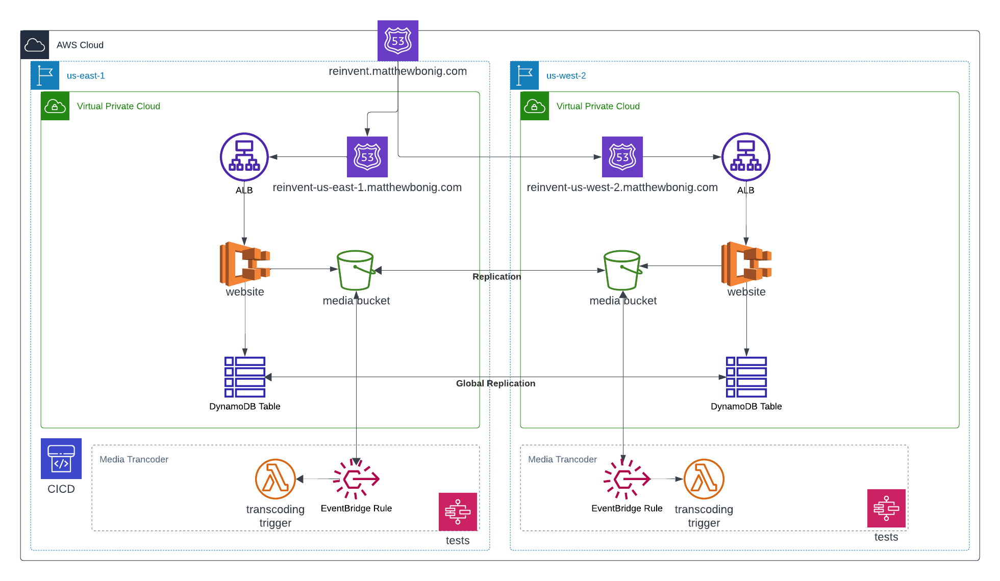

# Reinvent Demo CDK App

This is the demo application built for my talk at re:invent 2023. This is just demo-ware and is not a full-fledged application. It is meant to show how to use the AWS CDK to build a serverless application.

As you look through the code you will see there are multiple places where I've commented out things.
The commented code are things I could have or sometimes do add into projects, but didn't really need to make this code work.

## Architecture

